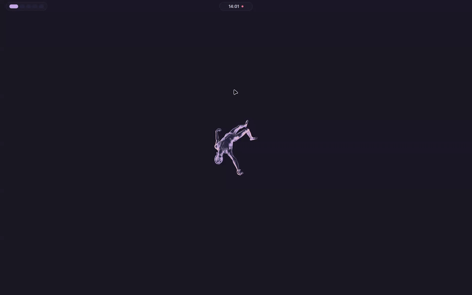

# nixos

> A flake-based NixOS config — Hyprland on Wayland, Rose Pine everywhere.

<br>



<br>

## Stack

| Layer | Choice |
|---|---|
| OS | NixOS unstable, flakes |
| Compositor | Hyprland (UWSM session) |
| Display mgr | greetd, autologin |
| Lock / idle | quickshell + hypridle |
| Desktop shell | quickshell (bar, control center, launcher, wallpaper, calendar, recorder, profiles, notifications, OSD, lock) |
| Wallpaper | awww |
| CLI shell | fish + starship + atuin + zoxide + fzf |
| Terminal | ghostty + herdr (tmux kept during the migration) |
| Editor | helix (Steel plugin fork) |
| Browser | helium, extensions pinned in Nix |
| AI agents | Claude Code, opencode, T3 Code nightly |
| Custom tools | gen-commit, ical-agenda, note-tui, backup |
| Secrets | sops-nix (age) |
| Backups | borg to the NAS over a Cloudflare tunnel |
| Bootloader | limine (Rose Pine themed) |
| Theme | Rose Pine Moon |

<br>

## Screenshots

<table>
  <tr>
    <td align="center"><br><sub>Terminal</sub></td>
    <td align="center"><br><sub>Browser</sub></td>
  </tr>
  <tr>
    <td align="center"><br><sub>Lockscreen</sub></td>
    <td align="center"><br><sub>Desktop</sub></td>
  </tr>
</table>

<br>

## Layout

```
.
├── flake.nix                      # hosts via mkHost; also exports gen-commit/ical-agenda and checks
├── hosts/
│   └── ryans-nixos/               # one directory per machine, named after its hostname
│       ├── default.nix            # stateVersions, NPU, monitor rule
│       ├── hardware-configuration.nix
│       └── sof-sdw-ptl-rt721.*    # audio fix for this laptop's codec only
├── modules/system/                # shared by every host
│   ├── default.nix                # locale, nix, hyprland, greetd, audio, power, fonts, zram
│   ├── boot.nix, users.nix        # limine, plymouth, kernel params; the ryan user
│   ├── secrets.nix, wifi.nix      # sops-nix secrets and templates; Wi-Fi profiles
│   └── backups.nix, backup.sh     # borg job and the `backup` CLI
├── secrets/                       # age-encrypted; see Secrets
├── tests/                         # bats tests run by `nix flake check`
├── backgrounds/                   # wallpapers
└── home/
    ├── default.nix                # entry point, XDG, session vars
    ├── desktop.nix, monitors.nix  # hyprland, hypridle, fuzzel; per-host monitor rules
    ├── shell.nix                  # fish, starship, atuin, zoxide, fzf, git
    ├── terminal.nix               # ghostty, herdr, tmux
    ├── editors.nix, helix/        # helix and its Steel plugins
    ├── programs.nix               # yazi, zathura, lazygit, btop, …
    ├── packages.nix               # user packages, GTK/Qt theming, helium
    ├── dev.nix                    # direnv, gh, ssh, toolchain env
    ├── custom-packages.nix        # t3code, lock-session, start-desktop, …
    ├── claude.nix, opencode.nix   # agent settings and MCP servers
    ├── gen-commit.*, ical-agenda.nix
    ├── quickshell/                # QML shell, symlinked live from ~/nixos
    ├── themes/                    # Rose Pine Moon colour files
    └── backgrounds.nix            # wallpaper install + default symlink
```

<br>

## Installation

> Requires a fresh NixOS install on an Intel machine, with a user named `ryan`.
> Tick disk encryption in the installer; the hardware scan below records it.

```bash
# The repo must live at ~/nixos: quickshell is symlinked from there.
nix-shell -p git --run 'git clone https://github.com/RNAV2019/nixos ~/nixos'
cd ~/nixos

# Reinstalling an existing host: regenerate its hardware file and skip ahead.
# A new machine gets its own hosts/<name>, which also becomes its hostname.
host=new-laptop
mkdir -p hosts/$host
sudo nixos-generate-config --show-hardware-config > hosts/$host/hardware-configuration.nix
```

For a new machine, write `hosts/$host/default.nix` from `hosts/ryans-nixos`,
keeping only what is true of the new hardware: the hardware import, both
`stateVersion`s set to the release just installed, and optionally
`desktop.monitors`. Add `$host = mkHost "$host";` to `nixosConfigurations` in
`flake.nix`, then `git add hosts/$host`, since flakes only see tracked files.

```bash
# Restore the age key from Bitwarden. It is the only thing not in this repo,
# and without it nothing below decrypts.
sudo install -Dm600 /path/to/age.key /etc/nixos-secrets/age.key

# The first build has to enable flakes and the Hyprland cache itself, because
# the config that sets them is not active yet.
sudo NIX_CONFIG='experimental-features = nix-command flakes
extra-substituters = https://hyprland.cachix.org
extra-trusted-public-keys = hyprland.cachix.org-1:a7pgxzMz7+chwVL3/pzj6jIBMioiJM7ypFP8PwtkuGc=' \
  nixos-rebuild switch --flake ~/nixos#$host

# Put the data back. Everything this needs was decrypted by the rebuild above,
# which is why it has to come last. Then reboot, which applies the hostname.
backup restore
```

Not restored by any of the above: Bluetooth pairings, and T3 Code / opencode
session history.

<br>

## Secrets

`secrets/secrets.yaml` is encrypted with [sops-nix](https://github.com/Mic92/sops-nix)
and holds the login password hash, the gh token, the cloudflared origin
certificate and tunnel credentials, the Cloudflare Access token and borg
passphrase and SSH key used by backups, the Google Calendar iCal addresses,
the Penpot MCP URL, and the OpenRouter and opencode API keys.

```bash
sudo edit-secrets             # secrets.yaml in helix; re-encrypts on save
sudo edit-secrets wifi.yaml   # any other file under secrets/
rebuild
```

```bash
sudo -v                              # authenticate first, on its own
umask 077
mkpasswd -m yescrypt | jq -Rs 'rtrimstr("\n")' > /tmp/hash.json
sudo SOPS_AGE_KEY_FILE=/etc/nixos-secrets/age.key \
  sops set --value-stdin secrets/secrets.yaml \
  '["users"]["ryan-hashed-password"]' < /tmp/hash.json
shred -u /tmp/hash.json
sudo chown ryan:users secrets/secrets.yaml
```

Wi-Fi passwords are in `secrets/wifi.yaml`, edited the same way. A new network
needs a line there and an entry in `modules/system/wifi.nix`.

<br>

## Daily Ops

```bash
rebuild           # sudo nixos-rebuild switch --flake ~/nixos (picks this hostname)
nix flake update  # bump all inputs
nix flake check   # gen-commit/ical-agenda tests, qmlformat
nix-clean         # garbage-collect old generations
```

<br>

## Backups

Borg archives are pushed daily to an append-only server on the NAS through a
Cloudflare tunnel. If the NAS is unreachable the job skips cleanly and the
persistent timer catches up later.

- **Included:** `~/Projects`, `~/Work`, `~/Documents`, `~/resume`, the XDG
  media folders, `~/Desktop`, `~/Downloads`, `~/.claude`, the Helium profile,
  and the atuin and zoxide databases.
- **Excluded:** `node_modules`, `.direnv`, `.venv`, `__pycache__`, any directory
  tagged with `CACHEDIR.TAG` (e.g. Cargo's `target/`), and caches in `~/.claude`
  and Helium.
- **First run:** the job never creates the repository (`doInit = false`).
  Create it once by hand with `borg init -e repokey-blake2`, seeding over
  the LAN by setting `lanSeed` in `modules/system/backups.nix`.
- **Retention:** this client's key cannot prune. Prune by hand on the NAS with
  the admin key. `backup status` warns once there are 60 archives.

```bash
backup now                 # run one immediately
backup status              # last run, next run, size, staleness
backup list [ARCHIVE]      # list archives or archive contents
backup restore [PATH...]   # restore paths, or everything, from a chosen archive
backup mount [ARCHIVE]     # browse an archive, then: backup umount
backup check [--data]      # verify repository integrity
```

<br>

## AI Commit Messages

`gen-commit` generates a Conventional Commit message from the staged Git
snapshot and commits it only after explicit confirmation. Repository status
and diff content are sent to OpenRouter.

Running it:

```bash
gen-commit
gen-commit --model google/gemini-2.5-flash-lite
```

<br>

## Keybinds

| Key | Action |
|---|---|
| `Super + Return` | Terminal |
| `Super + Shift + B` | Browser |
| `Super + Shift + F` | File manager |
| `Super + Space` | App launcher |
| `Super + W` | Close window |
| `Super + L` | Lock |
| `Super + Escape` | Logout menu |
| `Alt + A` | Control center |
| `Ctrl + Super + Space` | Wallpaper picker |
| `Alt + R` | Screen recorder |
| `Alt + C` | Calendar |
| `Alt + P` | Power profiles |
| `PrtSc` | Screenshot region |
| `Alt + PrtSc` | Screenshot output |
| `Super + Ctrl + PrtSc` | Screenshot all outputs |
| `Super + PrtSc` | Colour picker |

Full list in `home/desktop.nix`.
