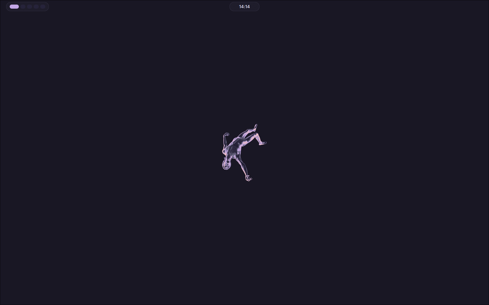
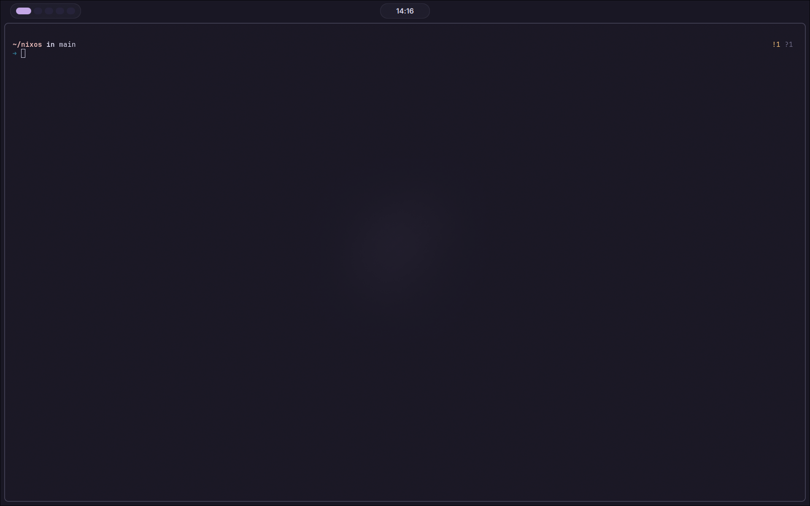
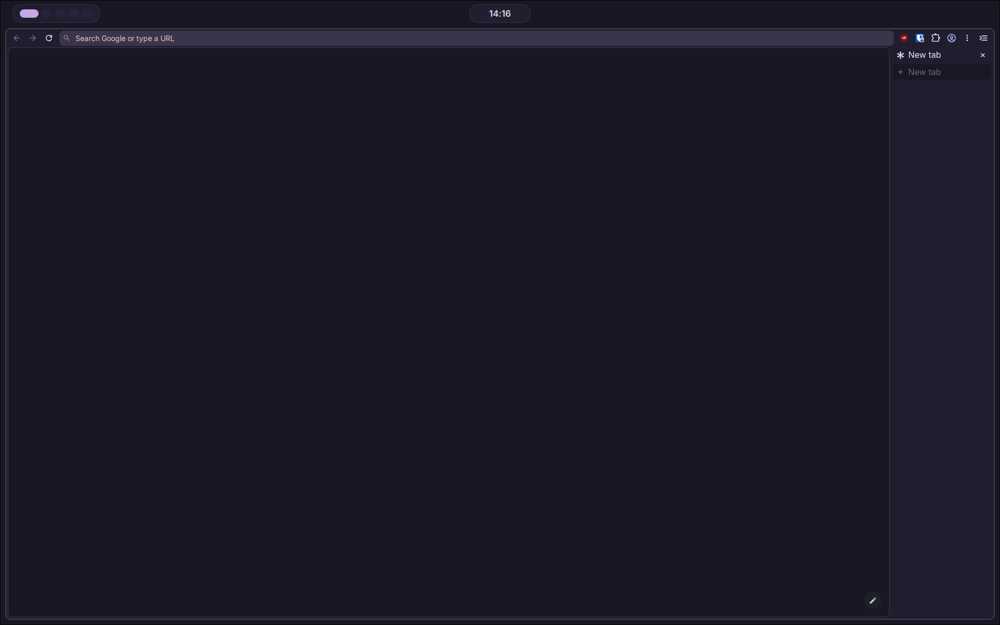
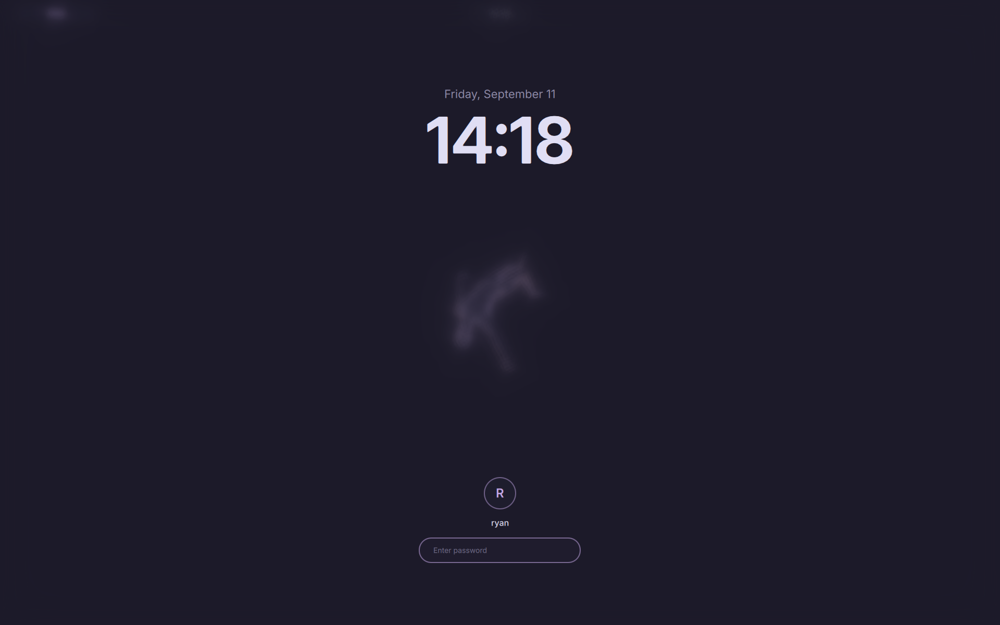

# nixos

> A flake-based NixOS config — Hyprland on Wayland, Rose Pine everywhere.

<br>



<br>

## Stack

| Layer | Choice |
|---|---|
| OS | NixOS unstable, flakes |
| Compositor | Hyprland (UWSM session) |
| Display mgr | greetd, autologin |
| Lock / idle | quickshell + hypridle |
| Shell (bar, panels, notifs, OSD, lock) | quickshell · mycelium |
| Wallpaper | awww |
| Shell | fish + starship + atuin + zoxide + fzf |
| Terminal | ghostty |
| Editor | helix |
| Browser | helium |
| Bootloader | limine (Rose Pine themed) |
| Theme | Rose Pine Moon |

<br>

## Screenshots

<table>
  <tr>
    <td align="center"><br><sub>Terminal</sub></td>
    <td align="center"><br><sub>Browser</sub></td>
  </tr>
  <tr>
    <td align="center"><br><sub>Lockscreen</sub></td>
    <td align="center"><br><sub>Desktop</sub></td>
  </tr>
</table>

<br>

## Layout

```
.
├── flake.nix
├── host/
│   ├── configuration.nix          # networking, users, locale, limine
│   └── hardware-configuration.nix
├── modules/system/                # greetd, hyprland, fonts, sops, …
├── secrets/secrets.yaml           # age-encrypted; see Secrets
└── home/
    ├── default.nix                # entry point, XDG, session vars
    ├── desktop.nix                # hyprland, quickshell, hypridle, fuzzel
    ├── shell.nix                  # fish, starship, atuin, zoxide, fzf, git
    ├── terminal.nix               # ghostty
    ├── editors.nix                # helix
    ├── programs.nix               # GUI/CLI apps
    ├── dev.nix                    # languages & toolchains
    ├── packages.nix               # flat user package list
    ├── custom-packages.nix
    ├── quickshell/                # QML shell: bar, panels, notifs, OSD, lock
    ├── themes/                    # Rose Pine Moon colour files
    └── backgrounds.nix            # wallpaper install + default symlink
```

<br>

## Installation

> Requires a working NixOS install with flakes enabled.

```bash
git clone https://github.com/RNAV2019/nixos ~/nixos

sudo nixos-generate-config --show-hardware-config > ~/nixos/host/hardware-configuration.nix

# Restore the age key. It is the only thing not in this repo, and without it
# nothing below decrypts.
sudo install -Dm600 /path/to/backup/age.key /etc/nixos-secrets/age.key

sudo nixos-rebuild switch --flake ~/nixos#ryans-nixos
```

<br>

## Secrets

`secrets/secrets.yaml` is encrypted with [sops-nix](https://github.com/Mic92/sops-nix)
and holds the login password hash, the gh token, the cloudflared origin
certificate and tunnel credentials, and the OpenRouter keys for gen-commit and
opencode.

```bash
sudo -E sops secrets/secrets.yaml    # edit; re-encrypts on save
sudo chown ryan:users secrets/secrets.yaml
rebuild
```

```bash
sudo -v                              # authenticate first, on its own
umask 077
mkpasswd -m yescrypt | jq -Rs 'rtrimstr("\n")' > /tmp/hash.json
sudo -E sops set --value-stdin secrets/secrets.yaml \
  '["users"]["ryan-hashed-password"]' < /tmp/hash.json
shred -u /tmp/hash.json
sudo chown ryan:users secrets/secrets.yaml
```
<br>

## Daily Ops

```bash
rebuild           # sudo nixos-rebuild switch --flake ~/nixos#ryans-nixos
nix flake update  # bump all inputs
nix-clean         # garbage-collect old generations
```

<br>

## AI Commit Messages

`gen-commit` generates a Conventional Commit message from the staged Git
snapshot and commits it only after explicit confirmation. Repository status
and diff content are sent to OpenRouter.

Running it:

```bash
gen-commit
gen-commit --model google/gemini-2.5-flash-lite
```

<br>

## Keybinds

| Key | Action |
|---|---|
| `Super + Return` | Terminal |
| `Super + Space` | App launcher (mycelium) |
| `Super + P` | Project picker |
| `Super + W` | Close window |
| `Super + L` | Lock |
| `Super + Escape` | Logout menu |
| `PrtSc` | Screenshot window |
| `Super + PrtSc` | Screenshot region |
| `Shift + PrtSc` | Screenshot monitor |

Full list in `home/desktop.nix`.
